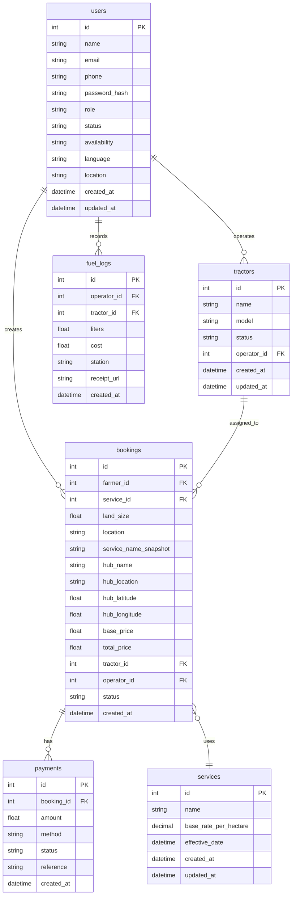

# TractorLink – Database Design

This document defines the MySQL database schema and Prisma ORM configuration for the TractorLink system.

---

## 1. Database Standards

To ensure consistency and prevent case-sensitivity issues, the following rules are mandatory:

- Table Names: lowercase, plural, snake_case (e.g., users, bookings)
- Column Names: lowercase, snake_case (e.g., created_at)
- Foreign Keys: use table_id format (e.g., farmer_id)
- Prisma Mapping:
  - Use @map for fields
  - Use @@map for tables
  - Keep camelCase in backend, snake_case in DB

---

## 2. Entity Relationship Diagram



---

## 3. Table Definitions

### 3.1 users
Stores all platform users.

- id: Primary Key  
- role: farmer | admin | operator  
- status: `active` | `inactive` → **authentication only** (determines login access)  
- availability: `available` | `busy` → **dispatch only** (determines operator job assignment)  
- language: `en` | `naira` → Interface language  

> ⚠️ RULE: `status` and `availability` must NEVER be mixed. Auth only checks `status`. Dispatch only checks `availability`.

---

- id: Primary Key  
- name: Tractor name/identifier  
- model: Tractor model/make  
- status: available | busy | maintenance  
- operator_id: Foreign Key (One-to-One with Operator)

---

### 3.3 services
Defines service types and base rates.

- name → plough, harrow, ridge, full  
- base_rate_per_hectare → used in pricing  
- effective_date → the date from which this rate is valid (supports past, present, and future)

---

### 3.4 bookings (Core Table)

This is the central table.

Includes:

#### Input Data
- farmer_id
- service_id
- land_size
- location

#### Historical Snapshots (Quote Integrity)
- service_name_snapshot → The name of the service at booking time
- hub_name → Name of the operational hub at booking time
- hub_location → Address/Description of the hub at booking time
- hub_latitude / hub_longitude → Coordinates of the hub at booking time

#### Pricing Breakdown
- base_price
- distance_km
- distance_charge
- fuel_surcharge
- total_price
- final_price

#### Assignment
- tractor_id
- operator_id

| status | String | `pending` | `pending`, `scheduled`, `dispatched`, `en_route`, `in_progress`, `completed`, `paid`, `cancelled` |
| scheduledAt | DateTime? | - | Explicit date/time set by Admin during Review |
| paymentStatus | String | `PENDING` | `PENDING`, `PARTIAL`, `PAID` |
| createdAt | DateTime | `now()` | - |

---

### 3.5 payments

Tracks financial transactions.

- booking_id → linked to booking  
- amount → numerical amount paid
- method → cash | mobile_money | bank_transfer | admin_settlement
- status → pending | partial | full (Represents coverage for this specific record)

---

### 3.6 fuel_logs

Tracks fuel consumption and expenditures.

- operator_id → linked to users (operator role)
- tractor_id → linked to tractors (optional)
- liters → amount of fuel in liters
- cost → total cost paid
- station → name of the fuel station
- receipt_url → link to uploaded receipt (optional)

---

### 3.7 system_settings

Stores dynamic pricing configuration.

- base_distance_km  
- price_per_km  
- fuel_price  
- minimum_charge  

---

## 4. Prisma Schema Example

```prisma
model User {
  id           Int      @id @default(autoincrement())
  name         String
  email        String   @unique
  phone        String?
  passwordHash String   @map("password_hash")
  role         String   @default("farmer")      // farmer | admin | operator
  status       String   @default("active")       // active | inactive — ONLY for authentication
  availability String   @default("available")    // available | busy — ONLY for operator dispatch
  language     String   @default("en")
  createdAt    DateTime @default(now()) @map("created_at")
  updatedAt    DateTime @updatedAt @map("updated_at")

  @@map("users")
}

model Tractor {
  id          Int      @id @default(autoincrement())
  name        String
  model       String?
  status      String   @default("available")
  operatorId  Int?     @unique @map("operator_id")

  createdAt   DateTime @default(now()) @map("created_at")
  updatedAt   DateTime @updatedAt @map("updated_at")

  @@map("tractors")
}

model Service {
  id                  Int       @id @default(autoincrement())
  name                String    @unique
  baseRatePerHectare  Float     @map("base_rate_per_hectare")
  effectiveDate       DateTime  @default(now()) @map("effective_date")
  createdAt           DateTime  @default(now()) @map("created_at")
  updatedAt           DateTime  @updatedAt @map("updated_at")
  bookings            Booking[]

  @@map("services")
}

model Booking {
  id              Int      @id @default(autoincrement())
  farmerId        Int      @map("farmer_id")
  serviceId       Int      @map("service_id")

  landSize        Float    @map("land_size")
  location        String

  basePrice       Float    @map("base_price")
  distanceKm      Float    @map("distance_km")
  distanceCharge  Float    @map("distance_charge")
  fuelSurcharge   Float    @map("fuel_surcharge")
  totalPrice      Float    @map("total_price")
  finalPrice      Float    @map("final_price")

  // Historical Snapshots
  serviceNameSnapshot String? @map("service_name_snapshot")
  hubName             String? @map("hub_name")
  hubLocation         String? @map("hub_location")
  hubLatitude         Float?  @map("hub_latitude")
  hubLongitude        Float?  @map("hub_longitude")

  tractorId       Int?     @map("tractor_id")
  operatorId      Int?     @map("operator_id")

  status          String   @default("scheduled")
  paymentStatus   String   @default("PENDING") @map("payment_status") // PENDING | PARTIAL | PAID

  payments        Payment[]

  createdAt       DateTime @default(now()) @map("created_at")
  updatedAt       DateTime @updatedAt @map("updated_at")

  @@map("bookings")
}

model Payment {
  id            Int      @id @default(autoincrement())
  bookingId     Int      @map("booking_id")
  amount        Float
  method        String   @default("cash") // cash, mobile_money, admin_settlement
  reference     String?
  status        String   @default("full") // pending, partial, full
  createdAt     DateTime @default(now()) @map("created_at")

  booking       Booking  @relation(fields: [bookingId], references: [id])

  @@map("payments")
}

model FuelLog {
  id          Int      @id @default(autoincrement())
  operatorId  Int      @map("operator_id")
  tractorId   Int?     @map("tractor_id")
  liters      Float
  cost        Float
  station     String
  receiptUrl  String?  @map("receipt_url")
  createdAt   DateTime @default(now()) @map("created_at")

  operator    User     @relation("OperatorFuelLogs", fields: [operatorId], references: [id])

  @@map("fuel_logs")
}

```

---

## 5. Critical Database Rules

1. Pricing must always be stored in DB (never rely on frontend)  
2. Booking is the central entity  
3. Status must follow strict lifecycle (FLOW.md)  
4. Use Decimal(10,2) for all money fields  
5. Always store assignment (tractor + operator)  
6. No business logic in database layer  

---

## 6. Notes

- Operators and tractors are pre-seeded in the system  
- Dispatch is auto-handled by backend  
- Schema is designed for future expansion (without breaking existing logic)  

---